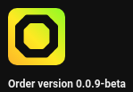

# The Official Order Electron Client :tada:



:construction: **!!!WARNING!!!** We're transitioning to new major breaking API changes both on the client and the back end. **This project is _not_ going to work completely at the moment** :construction:\

[//]: # (:construction: **!WARNING!** Both the client the back-end are in their beta stage right now. :construction:\)
Latest version: **0.4.0**

## Contributing
We ask of you here the same things we ask of you when you use our service: be kind and respectful to people. Treat every cotribution equally no matter its size. Even if it's just a letter change in a comment somewhere. Even if it's just a tiny bug report.

## Committing code
Please sign your commits. It is really easy to set up. This would be very nice, but you don't have to do it if you don't want to.

## Disclosing security vulnerabilities
Please disclose security vulnerabilities responsively. E-Mail me (`portasynthinca3@gmail.com`) about any security vulnerabilities. You should expect a response within 48 hours, though I will try to reply within 12 hours. If I do not reply within a week though, feel free to disclose it publicly.

I will receive your report and do my best to mitigate the vulnerability. Feel free to disclose it two weeks after the patch has been pushed to master if it's client-related, or immediately after me saying it's fixed if it's backend-related. Thank you.

## Build
Clone the repository, enter the cloned directory and run `npm run dist`, that's it!
```sh
git clone https://github.com/ordermsg/client-electron.git
cd client-electron
npm run dist
```
Or, if you want to just run it wuthout actually building the wrole thing, do `npm start` instead:
```sh
git clone https://github.com/ordermsg/client-electron.git
cd client-electron
npm instead
```

## Or download binaries
[...on the official Order website](https://ordermsg.tk/download)