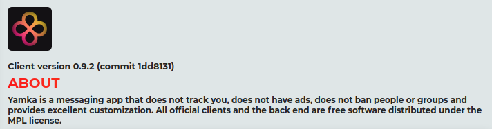

# Yamka Electron Client :tada:




:construction: Both the client the back-end are in their aplha stage right now. :construction:\
Latest version: **0.7.1**

## Committing code
Please sign your commits. It is really easy to set up. This would be very nice, but you don't have to do it if you don't want to.

## Disclosing security vulnerabilities
Please disclose security vulnerabilities responsively. E-Mail me (`portasynthinca3@gmail.com`) about any security vulnerabilities. You should expect a response within 48 hours, though I will try to reply within 12 hours. If I do not reply within a week though, feel free to disclose it publicly.

I will receive your report and do my best to mitigate the vulnerability. Feel free to disclose it two weeks after the patch has been pushed to master if it's client-related, or immediately after me saying it's fixed if it's backend-related. Thank you.

## Build
Do `npm start` to run the app without producing any artifacts:
```sh
git clone https://github.com/yamka-app/client-electron.git
cd client-electron
npm i
npm start
```

Use this to produce `AppImage` and `exe` artifacts:
```sh
git clone https://github.com/yamka-app/client-electron.git
cd client-electron
npm i
npm run dist
```

## Or download binaries
[...on our website](https://yamka.app/download)